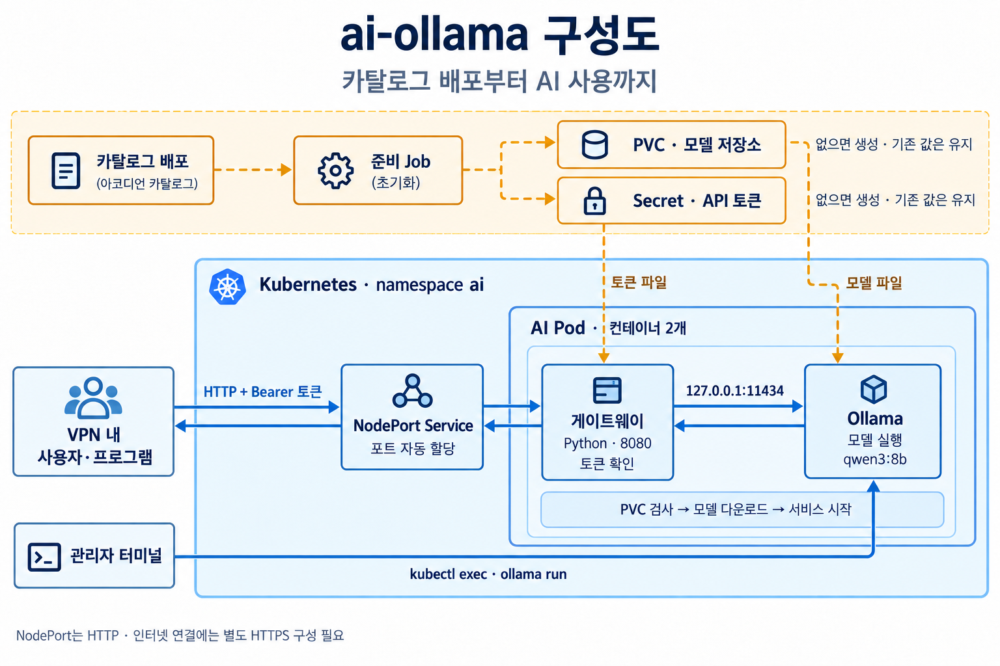

:toc: left
:toclevels: 2
:sectnums:
:sectnumlevels: 5
:source-highlighter: rouge
:rouge-style: github
:pdf-theme: ../../themes/cjk-theme.yml
:pdf-fontsdir: ../../fonts
:encoding: utf-8
:imagesdir: .
:doctype: book
:table-caption: 표
:stylesheet: ../../css/asciidoctor-accordion-hub.css
:docinfo: shared
:docinfodir: ../../docinfo/accordion-hub
:icons: font
:catalog-name: ai-ollama
:pipeline-name: -
:template-version: 3.1.0
:software-name: Ollama
:category-name: ai
:is-dev: false
:hardbreaks:
:hub_url: https://devhub.accordions.co.kr

= {catalog-name}

====
Ollama와 토큰 게이트웨이를 Kubernetes에 배포하는 AI 카탈로그입니다.
GPU 없이 CPU로 실행하며 기본 모델은 `qwen3:8b`입니다.
모델명은 변경할 수 있으며, 선택한 모델에 맞는 CPU·메모리·저장소가 필요합니다.
모델 저장용 PVC와 API 인증용 Secret이 없으면 자동 생성하고, 기존 리소스는 검증 후 재사용합니다.
관리자는 Kubernetes 권한으로 터미널에서 대화하고, 프로그램은 API 토큰으로 호출합니다.
====
include::{hub_url}/apis/images/adoc/common-template2.adoc[]

==== 요약
[%header,cols="20%,10%,10%,20%,15%,10%,15%",width=100%]
|===
^.^|이름 ^.^|버전 ^.^|카테고리 ^.^|소프트웨어 ^.^|언어 ^.^|APM ^.^|기술지원
^.^|{catalog-name} ^.^|{template-version} ^.^|{category-name} ^.^|{software-name} ^.^|Python ^.^|미포함 ^.^|별도 확인
|===

==== 개요
* Ollama 이미지: `ollama/ollama:0.34.2`
* 게이트웨이 및 준비 작업 이미지: `python:3.12-slim`
* 기본 모델: `qwen3:8b`
* 단일 Pod에 Ollama와 게이트웨이 배포, replica 1개
* Ollama 컨테이너: CPU 요청 `1`, 제한 `3`; 메모리 요청 `7Gi`, 제한 `9Gi` (변경 가능)
* 게이트웨이 컨테이너: CPU 요청 `100m`, 제한 `500m`; 메모리 요청 `64Mi`, 제한 `256Mi` (템플릿 고정값)
* NodePort 자동 할당 포트 → 게이트웨이 `8080` → Pod 내부 Ollama `127.0.0.1:11434`
* 모델 파일은 PVC에 저장하며 여러 노드의 CPU·메모리를 합치는 분산 추론은 제공하지 않음
* API는 텍스트 `/api/chat` POST만 지원하며 입력된 모델명으로 고정

==== 구성도

* 사용자 프로그램의 요청은 NodePort → 게이트웨이 → Ollama 순서로 전달됩니다.
* 게이트웨이와 Ollama는 하나의 Pod 안에서 각각 컨테이너로 실행됩니다.
* 준비 Job은 PVC와 API 토큰 Secret을 확인하고, 없으면 생성합니다.
* 관리자 터미널은 Kubernetes 권한으로 Ollama에 직접 접속합니다.

==== 배포리소스
* ConfigMap: 게이트웨이 코드 및 PVC·Secret 준비 코드, 각 1개
* ServiceAccount: 준비 작업 계정 및 PVC 검사 계정, 각 1개
* Role / RoleBinding: 두 계정의 권한 설정, 각각 2개
* Job: PVC·Secret 조회 및 자동 생성
* Deployment: PVC 검사 → 모델 준비 → Ollama·게이트웨이 실행
* Service: NodePort 자동 할당 포트
* PVC / Secret: 준비 Job이 없을 때 생성하며 카탈로그 선언 리소스에는 포함하지 않음

==== ValueSchema 및 Resource Values
[%header,cols="15,15,8,32a,15,15a",width=100%]
|===
^.^|이름 ^.^|변수명 ^.^|타입 ^.^|설명 ^.^|기본 Values ^.^|Resource Value

|Ollama 이미지 |ollamaImage |string
|Ollama 및 모델 준비 컨테이너 이미지입니다. 배포 노드에서 다운로드 가능해야 합니다.
|ollama/ollama:0.34.2 |`ollamaImage: "ollama/ollama:0.34.2"`

|게이트웨이 이미지 |gatewayImage |string
|Python 실행 이미지입니다. 준비 Job과 PVC 검사에도 사용합니다.
|python:3.12-slim |`gatewayImage: "python:3.12-slim"`

|모델명 |model |string
|태그를 포함한 Ollama 모델명입니다. 변경하면 PVC에 새 모델을 준비합니다.
|qwen3:8b |`model: "qwen3:8b"`

|모델 PVC 이름 |pvcName |string
|동일 namespace의 모델 전용 PVC를 조회하고 없으면 생성합니다. 기존 PVC는 수정하지 않습니다.
|ai-models |`pvcName: "ai-models"`

|API 토큰 Secret |tokenSecret |string
|동일 namespace의 Secret을 조회하고 없으면 랜덤 토큰을 생성합니다. 기존 토큰은 유지합니다.
|ai-api-token |`tokenSecret: "ai-api-token"`

|CPU 요청 |cpuRequest |string
|Ollama와 모델 준비 작업의 CPU 요청량입니다. Pod 배치에는 게이트웨이 요청 100m도 고려합니다.
|1 |`cpuRequest: "1"`

|CPU 제한 |cpuLimit |string
|Ollama와 모델 준비 작업의 CPU 사용 상한입니다.
|3 |`cpuLimit: "3"`

|메모리 요청 |memoryRequest |string
|Ollama와 모델 준비 작업의 메모리 요청량입니다.
|7Gi |`memoryRequest: "7Gi"`

|메모리 제한 |memoryLimit |string
|Ollama와 모델 준비 작업의 메모리 상한입니다. 모델에 맞는 용량을 지정합니다.
|9Gi |`memoryLimit: "9Gi"`

|StorageClass |storageClass |string
|실제 클러스터의 StorageClass 이름입니다. 기존 PVC의 클래스와 일치해야 합니다.
|accordion-storage |`storageClass: "accordion-storage"`

|PVC 용량 |storageSize |string
|신규 PVC 요청 용량 및 기존 PVC의 최소 요청 용량입니다. 기존 PVC를 자동 확장하지 않습니다.
|20Gi |`storageSize: "20Gi"`

|준비 작업 버전 |storageRevision |string
|준비 Job 재실행 및 설정·코드 변경 시 이전보다 큰 숫자를 지정합니다.
|2 |`storageRevision: "2"`
|===

==== 연관 파이프라인
* 없음

[[install]]
==== 설치
===== ClusterPipelineTemplate
* 없음

include::{hub_url}/apis/images/adoc/catalog-install-template2.adoc[]

===== 배포 전 확인
* 카탈로그 형식: `ClusterCatalogTemplate`
* 패키지 라벨: `packageName: ai-ollama`, `version: "3.1.0"`
* 템플릿에 클러스터·namespace를 고정하지 않습니다. 배포 화면에서 대상 클러스터와 namespace를 선택하고 실제 적용 결과를 확인합니다.
* 노드의 예약 가능한 CPU·메모리, taint, StorageClass와 NodePort 접근 경로를 확인합니다.
* 배포 후보 노드는 컨테이너 이미지와 Ollama 모델 다운로드 경로에 접근할 수 있어야 합니다.
* 준비 계정의 Role/RoleBinding 생성 권한이 필요합니다.
* 일반 Kubernetes에서도 표준 YAML로 배포할 수 있습니다.

===== 자동 준비와 시작 순서
. Job이 PVC를 조회하고 없으면 지정 StorageClass·용량으로 생성합니다.
. 기존 PVC는 클래스·용량·접근 모드·상태를 확인하고 조건 불일치 시 실패합니다.
. Secret이 없으면 보안 난수 32바이트를 64자리 토큰으로 생성해 `token` 키에 저장합니다.
. 기존 Secret은 검증 후 유지하며 잘못된 토큰을 임의로 덮어쓰지 않습니다.
. AI Pod가 볼륨을 마운트하고 PVC 조건을 다시 검사합니다.
. 모델 다운로드·검증이 완료되면 Ollama와 게이트웨이를 시작합니다.

준비 중 `PVC not found` 또는 `Secret not found` 이벤트가 잠시 발생할 수 있습니다.
지속되면 준비 Job 로그를 확인합니다. `WaitForFirstConsumer`의 PVC Pending은 Pod 배치 전 정상일 수 있습니다.

==== 사용 방법
명령의 `ai`는 namespace, `ai-ollama`는 배포 이름 예시입니다. 실제 배포 값으로 바꿉니다.

===== 터미널 대화
[source,bash]
----
kubectl -n ai exec -it deployment/ai-ollama -c ollama -- ollama run qwen3:8b
----

`/bye`로 종료합니다. Kubernetes exec 권한이 필요하며 게이트웨이 API 토큰은 사용하지 않습니다.
터미널 호출은 게이트웨이의 동시 요청 제한을 거치지 않아 API와 동시에 사용하면 자원을 경쟁합니다.

===== VPN 내 API 호출
노드 IP와 실제 할당된 NodePort에 접근 가능한 PC·서버에서 사용합니다.
같은 클러스터에서는 `http://ai-ollama.ai.svc:8080/api/chat` 주소도 사용할 수 있습니다.
아래 토큰 조회는 Secret 조회 권한이 있는 관리자 터미널에서 실행합니다.

[source,bash]
----
AI_TOKEN="$(kubectl -n ai get secret ai-api-token -o jsonpath='{.data.token}' | base64 --decode)"
NODE_PORT="$(kubectl -n ai get svc ai-ollama -o jsonpath='{.spec.ports[0].nodePort}')"
curl --max-time 200 "http://<노드IP>:${NODE_PORT}/api/chat" \
  -H "Authorization: Bearer ${AI_TOKEN}" \
  -H 'Content-Type: application/json' \
  -d '{"messages":[{"role":"user","content":"한국어로 짧게 인사해줘."}]}'
unset AI_TOKEN NODE_PORT
----

기존 Service를 갱신하면 일반적으로 할당 포트가 유지됩니다. Service 삭제 후 다시 생성하면 포트가 바뀔 수 있습니다.
API 토큰은 사용할 백엔드의 비밀 설정에 저장합니다. 브라우저 코드·Git·공개 로그에 넣지 않습니다.
NodePort는 HTTP입니다. 인터넷 연결에는 외부 통신 경로와 HTTPS 프록시 및 요청 제한을 별도로 구성합니다.

==== 재배포 및 모델 변경
* 같은 PVC·Secret 이름을 유지하면 모델 파일과 API 토큰을 재사용합니다.
* 모델명을 변경하면 새 모델을 준비합니다. 기존 모델 파일은 PVC에 남습니다.
* 준비 코드·Python 이미지·PVC/Secret 설정 변경 또는 Job 실패 재시도 시 `storageRevision`을 증가시킵니다.
* 완료된 동일 Job은 Apply만으로 재실행되지 않습니다. 삭제된 PVC·Secret 복구에도 새 준비 버전을 사용합니다.
* 게이트웨이 코드만 변경하면 Pod 재시작이 필요합니다.
* `Recreate` 업데이트 중 서비스가 중단됩니다.
* 독립적인 배포는 namespace 또는 PVC·Secret 이름을 분리하고 NodePort는 Service별로 자동 할당됩니다.

==== 권한 및 데이터 보존
* 준비 Job은 지정 PVC·Secret 조회와 같은 namespace 내 생성 권한을 가집니다. 수정·삭제 권한은 없습니다.
* Kubernetes RBAC의 생성 권한은 특정 리소스 이름으로 제한할 수 없습니다.
* 시작 전 검사 계정은 지정 PVC 조회만 허용합니다.
* Ollama와 게이트웨이에는 Kubernetes ServiceAccount 토큰을 마운트하지 않습니다.
* Job이 생성한 PVC·Secret에는 ownerReferences를 부여하지 않습니다.
* 일반 Kubernetes의 앱 YAML 삭제에는 PVC·Secret이 포함되지 않습니다. Accordion 자체 정리 정책은 확인이 필요합니다.
* namespace 또는 PVC·Secret 직접 삭제는 별개이며 PV의 reclaimPolicy를 확인합니다.
