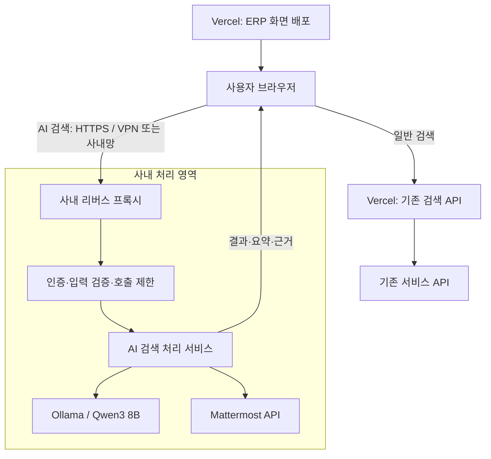

# 사내 AI 검색 API 구조 및 설계 계획

- 작성일: 2026-09-28
- 상태: 설계 초안. 구현·서버 설정·배포는 수행하지 않았다.
- 대상: 기존 ERP Console, 독립 사내 검색 API, Ollama의 `qwen3:8b`
- 운영 원칙: 같은 저장소에서 관리하고 Vercel 앱과 사내 API를 독립적으로 배포한다.

### 2026-09-29 보완: 재사용 모델 API와 카탈로그

- AI 검색 이용 자격은 유효한 Mattermost 사용자로 정한다. 별도 회사 Google 로그인 조건은 추가하지 않는다. 자료 조회는 해당 Mattermost 사용자의 권한을 유지한다.
- 재사용 모델 API와 Mattermost 검색 API를 분리한다. 검색 API는 사용자 토큰을 검증하고 서버에 보관한 AI 서비스 키로 모델 게이트웨이를 호출한다. 공용 AI 키를 브라우저에 전달하지 않는다.
- [Accordion 카탈로그 초안](../deploy/accordion/README.md)은 단일 Ollama Pod와 Bearer 게이트웨이, 인터넷 모델 다운로드, 기존 PVC/Secret 연결을 제공한다. 이 초안에는 Mattermost 검색 API와 웹페이지 변경은 포함되지 않는다.
- 초안은 단일 키·단일 replica이며 토큰 발급 관리 UI, 분산 추론, 외부 HTTPS 경로는 후속 범위다. 실제 Accordion 배포는 아직 검증하지 않았다.

## 1. 목표와 범위

기존 일반 검색은 현재 Vercel API 경로를 유지한다. AI 검색을 선택한 경우에만 사용자 브라우저가 VPN 또는 사내망을 통해 사내 API를 직접 호출한다. 화면 변경 때마다 ERP 전체를 사내에 재배포하지 않는 것이 목표다.

첫 대상은 Mattermost 메시지와 스레드다. Qwen3가 자연어 질문에서 검색어를 생성하고, 실제 검색 결과를 선별·요약해 원문 링크와 함께 제공한다.

| 단계 | 포함 범위 |
|---|---|
| 1차 | 검색어·기간·채널 조건 추출, 사용자 권한으로 메시지 검색, 제한된 스레드 조회, 요약·인용·원문 링크 |
| 후속 | 첨부파일 본문 추출, 로컬 임베딩·검색 인덱스, 다른 서비스 확장, 필요 시 MCP 어댑터 |
| 제외 | cokacremote, 셸 실행, 메시지 작성·삭제, DB 직접 조회, 외부 모델 자동 전환, 전체 대화 상시 수집 |

1차 키워드 확장은 단어가 전혀 다른 자료를 놓칠 수 있다. 이를 완전한 의미 검색으로 표시하지 않는다. 검색 누락이 크면 별도 임베딩 모델과 권한을 반영한 검색 인덱스를 설계한다.

## 2. 현재 확인 상태

| 항목 | 확인 내용 | 근거 |
|---|---|---|
| ERP | Next.js 16, React 19, TypeScript, Vercel | 저장소 코드·설정 |
| 일반 검색 | 브라우저 → `/api/search` → 서비스별 API | 화면·검색 Route Handler |
| Mattermost 미리보기 | `/api/mattermost/thread`로 조회 | 기존 화면·Route Handler |
| 인증 | 사용자 토큰을 localStorage에 저장하고 요청 헤더로 전달 | `useMattermostAuth.ts` |
| 검색 | 키워드·공백 변형·문자열 유사도 | 기존 검색 구현 |
| Mattermost | 10.3.4 / MySQL / 스키마 128 | 사용자 제공 정보. 서버 직접 검증 아님 |
| 모델 | `qwen3:8b`, 파일 약 5.2 GB | 사용자 제공 `ollama ls` 결과 |
| 네트워크 | 모델 서버는 VPN 또는 사내망에서 접근 | 사용자 설명. API 포트 접근 미검증 |

모델 파일 크기로 실행 메모리나 속도를 판단하지 않는다. 실제 Ollama 버전·GPU·컨텍스트 설정은 미확인이다. Mattermost 도메인이 현재 PC에서 사설 IP로 해석된 것은 확인했으나, 해당 IP가 실제 실행 서버인지 프록시인지 알 수 없다. 운영 Vercel에서의 접근 경로도 별도 확인이 필요하다.

## 3. 전체 구조



- Vercel은 화면을 제공하지만 AI 검색 질문·결과를 중계하지 않는다.
- 사용자 PC의 VPN은 브라우저 요청에 적용되며 Vercel Function에 자동 적용되지 않는다.
- AI 모드는 기존 Vercel 검색 API를 호출하지 않는다. AI 결과의 스레드 미리보기도 사내 API로 보낸다.
- 일반 검색과 기존 OAuth 토큰 교환은 현재 경로를 유지한다. 따라서 인증 정보나 서비스 전체가 사내에서만 처리된다고 설명하지 않는다.
- 사내 API와 Ollama는 같은 서버 또는 통신 가능한 별도 서버에 배치할 수 있다. 실제 배치 위치는 자원·운영 조건 확인 후 확정한다.

### 데이터 경계

AI 검색 데이터가 Vercel 서버를 통과하지 않더라도 Vercel에서 배포한 JavaScript는 브라우저의 질문과 결과에 접근할 수 있다. 프런트엔드 공급망·배포 권한도 신뢰 대상이며, 완전한 망분리나 유출 불가능 구조로 간주하지 않는다.

질문·본문·응답을 URL 쿼리, 분석 이벤트, 오류 수집, 세션 리플레이에 싣지 않는다. 검색 자료의 HTML·외부 이미지를 자동 실행·로드하지 않는다. 원문 링크는 모델이 만든 URL 대신 서버가 검증된 Mattermost 주소와 결과 ID로 생성한다.

## 4. 저장소와 실행 단위

다음은 추가 예정 구조다. 이번 문서 작업에서는 서비스 파일을 생성하지 않는다.

```text
erp_console/
├─ src/
│  ├─ app/search/page.tsx          # 일반/AI 모드와 결과 화면
│  └─ lib/ai-search-client.ts      # 브라우저 전용 사내 API 클라이언트
├─ services/internal-ai-search/
│  ├─ src/
│  │  ├─ server.ts                 # HTTP 서버
│  │  ├─ auth/                     # 사용자 검증
│  │  ├─ routes/                   # 상태·검색·스레드 API
│  │  ├─ search/                   # 제한된 검색 처리 흐름
│  │  ├─ providers/ollama.ts       # 모델 API 어댑터
│  │  └─ connectors/mattermost.ts  # 허용된 조회 API
│  ├─ test/
│  ├─ package.json
│  ├─ package-lock.json
│  ├─ tsconfig.json
│  ├─ Dockerfile
│  └─ .env.example
└─ docs/INTERNAL_AI_SEARCH_PLAN.md
```

TypeScript 기반 독립 Node.js 서비스를 제안한다. 프레임워크·버전은 구현 시 확정한다. 처음에는 루트 앱과 독립 의존성·잠금 파일을 사용하며 전체 저장소의 워크스페이스 전환은 요구하지 않는다.

현재 루트 `tsconfig.json`은 `**/*.ts` 등을 포함하므로 폴더만 분리해서는 빌드가 분리되지 않는다. 구현 시 아래 작업이 필요하다.

- 루트 TypeScript·ESLint에서 서비스 경로를 적절히 제외하고 서비스 자체 검사로 대체한다.
- Vercel 앱에서 서비스 구현을 import하지 않고 HTTP 계약으로만 연결한다.
- 서비스는 `src/app` 외부에 두고 Vercel 설치·빌드와 독립시킨다.
- Docker 컨텍스트에서 실제 환경 파일·비밀값·불필요한 루트 파일을 제외한다.
- 초기 계약은 JSON 스키마와 계약 테스트로 관리하고, 공유 타입 패키지는 필요해질 때 도입한다.

## 5. 인증과 읽기 권한

### 1차 제안: 기존 사용자 토큰의 요청 단위 사용

1. 브라우저가 고정된 사내 API에 Mattermost access token을 Authorization 헤더로 전달한다.
2. 사내 API는 설정된 Mattermost의 `/api/v4/users/me`로 토큰을 검증한다.
3. 확인된 사용자 ID를 호출 제한 기준으로 사용하고, 동일 토큰으로 검색·스레드를 조회한다.
4. 토큰은 요청 중에만 사용한다. 모델 입력·로그·응답·영구 저장에 포함하지 않는다.
5. 만료·취소·권한 변경 시 실제 Mattermost 응답을 반영한다.

클라이언트가 보낸 사용자 ID를 신뢰하지 않는다. 채널·스레드 ID를 직접 요청하더라도 매번 사용자 토큰으로 접근 권한을 확인한다. 관리자 공용 토큰으로 전체 자료를 검색한 뒤 UI에서 숨기는 방식은 사용하지 않는다.

토큰 자체가 읽기 전용인지는 아직 확인되지 않았다. API 서비스의 기능을 조회로 제한하고 실제 OAuth 권한은 별도 검증한다. 검색 API가 POST 방식이어도 기능이 조회라면 허용할 수 있다. 허용 경로·메서드를 고정하고 임의 URL 프록시·셸·DB 접근 기능은 제공하지 않는다.

기존 localStorage 토큰은 브라우저 스크립트가 접근할 수 있다. 이번 기능이 그 제약을 해결한 것으로 간주하지 않는다. 향후 사내 전용 OAuth·세션을 도입한다면 만료·취소·팝업 origin·cross-site 쿠키 정책을 별도 설계한다. 공용 비밀 API 키를 프런트엔드에 넣지 않는다.

### HTTPS·CORS·브라우저 정책

- 사내 DNS와 신뢰되는 HTTPS 인증서를 준비한다. 인증서 검증 우회를 운영 절차로 삼지 않는다.
- 운영 ERP origin을 정확히 허용한다. CORS는 사용자 인증을 대신하지 않는다.
- OPTIONS preflight는 인증 없이 처리하되 허용된 origin·메서드·헤더만 응답한다. 실제 데이터 요청은 인증한다.
- 초기에는 Authorization 헤더를 사용해 cross-site 쿠키 의존성을 피한다.
- 개발·미리보기 origin은 별도 관리하고 전체 `*.vercel.app`을 허용하지 않는다.
- 사설망 접근 승인·기업 정책은 실제 대상 브라우저에서 확인한다. 보안 기능 비활성화를 전제로 하지 않는다.

## 6. API 계약 초안

아래 경로는 제안이며 현재 구현되어 있지 않다.

| 메서드·경로 | 역할 | 정책 |
|---|---|---|
| `GET /healthz` | 프로세스 생존·브라우저 연결 시험 | 최소 상태만 반환. 모델·인프라 정보 미노출 |
| `GET /v1/capabilities` | 계약 버전·지원 기능 | 사용자 인증 필요 |
| `POST /v1/ai-search` | 자연어 검색·요약 | 사용자 인증, 크기·횟수 제한 |
| `GET /v1/threads/{postId}` | 결과의 스레드 미리보기 | 매 요청 권한 확인, 응답 크기 제한 |

`/healthz` 성공이 모델·Mattermost 정상까지 보증하지는 않는다. 브라우저 네트워크 오류만으로 VPN·DNS·CORS·서버 장애를 단정하지 않는다.

### 검색 요청 예시

```json
{
  "query": "최근 배포 일정이 밀려서 임시 대응했던 대화를 찾아줘",
  "filters": {
    "dateRange": "1m",
    "channelIds": [],
    "includeDirectMessages": false
  },
  "limit": 10
}
```

기간은 우선 기존 `all | 1w | 1m | 3m`과 맞춘다. 사용자 필터는 모델 추론보다 우선하며 범위를 몰래 확대하지 않는다. 개인·그룹 DM은 초기 기본 제외하고 명시적으로 포함한 경우만 조회한다. Mattermost 10.3.4에서 해당 필터의 실제 적용 방식을 검증한다.

### 응답 형태 예시

```json
{
  "apiVersion": "1",
  "requestId": "opaque-request-id",
  "status": "complete",
  "answer": "관련 대화를 찾았습니다.",
  "results": [],
  "citations": [],
  "warnings": [],
  "truncated": false
}
```

- 예시는 필드 구조를 보여준다. 실제 검색 0건은 `no_results`와 해당 안내를 반환한다.
- `results`는 기존 `SearchResult` 필수 필드를 맞추고 `source`를 `mattermost`로 제한한다. 브라우저에서 런타임 검증 후 카드에 전달한다.
- `citations`는 `{ resultId, postId, quote }` 배열로 제안한다. 인용 ID·문구가 실제 허용된 결과에 있는지 서버가 검증한다.
- `status`는 `complete | partial | no_results`로 구분한다.
- 일부 팀 검색 실패·출력 잘림·요약 실패는 `warnings`와 `truncated`로 드러낸다. 검색 실패를 0건으로 숨기지 않는다.
- 요약만 실패하면 결과 목록을 `partial`로 제공할 수 있다.
- 검색·스레드 응답은 `Cache-Control: no-store`를 사용한다.

| HTTP 상태 | 오류 코드 예 | 처리 |
|---|---|---|
| 400 | `INVALID_QUERY` | 조건 수정 안내 |
| 401 | `AUTH_REQUIRED` | 재연결 안내 |
| 403 | `ACCESS_DENIED` | 접근 불가 |
| 429 | `RATE_LIMITED` | 재시도 시간 안내 |
| 503 | `MODEL_UNAVAILABLE`, `CAPACITY_EXCEEDED` | 모델 장애·대기열 초과 안내 |
| 502 / 504 | `UPSTREAM_ERROR`, `UPSTREAM_TIMEOUT` | 조회 실패·기한 초과 안내 |

오류에는 안전한 코드·requestId를 포함하고 비밀값·내부 주소·스택은 제외한다. 네트워크 단절은 HTTP 응답 오류와 별도로 처리한다.

## 7. 모델과 검색 처리 흐름

1. 입력·인증·동시성 제한을 검사한다.
2. Qwen3가 질문을 최대 3개 검색어 후보와 허용된 필터 구조로 변환한다.
3. 서버가 JSON 스키마·길이·필터를 검증하고 검색 문법을 구성한다.
4. 원래 질문의 유효 키워드와 후보로 Mattermost를 검색한다.
5. 권한·기간·채널·DM 조건을 검사하고 ID로 중복 제거 및 스레드별 묶음을 수행한다.
6. 제한된 후보만 스레드 문맥을 추가 조회한다.
7. Qwen3가 허용된 근거에서 관련 결과를 선별하고 짧게 요약한다.
8. 인용·링크·응답 형식을 검증해 반환한다.

모델의 도구 호출 지원은 필수 조건이 아니다. 초기는 두 단계 모델 호출과 서버의 고정 흐름으로 시작한다. 모델이 URL·SQL·셸 명령을 생성해도 실행하지 않는다. 자료 속 지시는 신뢰하지 않으며, 권한·횟수 제한은 코드가 강제한다.

설치된 Ollama의 구조화 출력 지원을 확인한다. 잘못된 모델 JSON의 복구 시도는 최대 1회로 제한한다. 모델 ID는 서버의 `OLLAMA_MODEL`로 고정하고 사용자가 임의 모델을 선택하지 못하게 한다. Qwen3 채팅 모델이 임베딩 모델 역할까지 수행한다고 가정하지 않는다.

## 8. 자원 예산과 실패 처리

아래는 시작 제안이며 실측 후 확정한다.

| 항목 | 제안 |
|---|---|
| 질문 | 최대 2,000자 |
| 검색어 | 최대 3개 |
| 검색 후보 | 최대 50개 메시지 |
| 추가 스레드 | 최대 5개, 각각 본문 제한 |
| 표시 결과 | 최대 10개 |
| upstream 호출 | 팀·페이지·상세 조회를 합친 전체 요청 예산 적용 |
| 모델 입력 | 실제 컨텍스트 설정에서 출력·추론 여유를 뺀 토큰 예산 적용 |
| 사용자 동시 요청 | 1개 |
| 모델 동시 처리 | 초기 1개, 유한 대기열 |
| 전체 요청 기한 | 우선 60초, 실측 후 조정 |

무제한 재검색·페이지 수집을 하지 않는다. 제한 도달 시 부분 결과 또는 명확한 오류를 반환한다. 프록시·서버·브라우저 타임아웃을 맞추고 취소를 upstream에 전달한다. 연결 취소가 실제 GPU 작업까지 즉시 중단하는지는 검증한다. 초기에는 JSON 단일 응답을 사용하고 단계별 스트리밍은 필요 시 추가한다.

## 9. 화면 통합

- 일반 검색을 기본값으로 유지하고 AI 검색은 명시적으로 선택한다.
- AI 범위가 Mattermost임을 표시하고 다른 서비스 필터를 조용히 무시하지 않는다.
- API 미설정 환경은 기능 숨김 또는 미설정 안내로 처리한다.
- VPN·브라우저 권한·서버 연결 실패 안내와 인증 만료 안내를 구분한다.
- 실패 시 외부 AI로 전환하지 않는다. 일반 검색으로 전환하더라도 사용자가 실행하기 전에는 자동 제출하지 않는다.
- 새 검색·모드 변경 시 이전 요청을 취소하고 요청 ID로 늦은 응답을 무시한다.
- AI 결과의 미리보기는 사내 스레드 API를 사용하도록 조회 경로를 보존한다.
- AI 질문·결과는 초기에는 브라우저 메모리에만 두고 localStorage·URL·서비스 워커에 저장하지 않는다.

## 10. 환경 설정·운영

다음은 제안 설정이며 실제 환경 파일은 이번 작업에서 변경하지 않는다.

| 위치 | 설정 | 목적 |
|---|---|---|
| Vercel | `NEXT_PUBLIC_INTERNAL_AI_API_URL` | 브라우저용 사내 HTTPS 주소. 비밀값 아님 |
| Vercel | `NEXT_PUBLIC_INTERNAL_AI_ENABLED` | UI 활성화 |
| 사내 API | `MATTERMOST_BASE_URL` | 고정 검색 대상 |
| 사내 API | `OLLAMA_BASE_URL` | 내부 모델 주소 |
| 사내 API | `OLLAMA_MODEL` | `qwen3:8b` |
| 사내 API | `ALLOWED_ORIGINS` | 정확한 ERP origin 목록 |
| 사내 API | 기한·결과·동시성 설정 | 자원 제한 |

`NEXT_PUBLIC_` 값은 빌드에 반영되므로 변경 시 Vercel 재배포가 필요하다. 비밀값·사용자 토큰은 여기에 넣지 않는다.

사내 API는 비특권 계정/컨테이너로 실행하고 호스트 전체 파일·Docker 소켓 접근을 제공하지 않는다. Ollama는 검색 API만 접근하도록 제한하며 같은 호스트면 loopback을 우선한다. 임의 URL 프록시나 Ollama 관리 API를 노출하지 않는다. 인증 헤더가 다른 upstream으로 전달되지 않도록 목적지·리다이렉트를 통제한다.

로그는 requestId·상태·지연·호출 수·토큰 수·오류 코드 중심으로 기록한다. 사용자 감사 식별자는 내부 보존 정책에 따라 최소화한다. 질문·대화·토큰·모델 프롬프트는 기본 로그에서 제외하고 프록시·APM에도 적용한다. 외부 AI 대체·웹 검색을 사용하지 않으며 Ollama의 로컬 실행 설정을 버전에 맞게 검증한다.

## 11. 독립 배포와 호환성

| 변경 | 배포 |
|---|---|
| 화면·브라우저 클라이언트·루트 앱 설정 | Vercel |
| 사내 API 구현·모델·프롬프트 | 사내 서비스 |
| 문서만 | 런타임 배포 불필요 |
| API 계약의 비호환 변경 | 버전 전환에 따라 양쪽 |

같은 저장소라고 경로별 배포가 자동 구성되지는 않는다. Vercel 빌드 생략 조건과 사내 이미지 빌드 조건을 각각 설정·검증한다. 루트 의존성·빌드 설정·향후 공유 계약 변경도 트리거에 포함한다.

사내 서비스는 독립 잠금 파일로 만든 버전 고정 이미지/패키지를 사용한다. 자동 배포가 필요하면 사내망 접근 가능한 실행기를 사용하며, 실제 배포 수단·권한은 인프라 확인 후 확정한다.

API는 추가 필드 호환성을 유지하고 필드 제거·의미 변경은 새 버전으로 제공한다. 호환 API를 먼저 배포한 뒤 화면을 전환한다. 모델·프롬프트도 버전을 기록해 API만 되돌릴 수 있게 한다. 장애 시 AI 기능 비활성화 또는 이전 API 복구로 대응하고 일반 검색 경로는 유지한다.

## 12. 구현 순서와 검증 기준

### 단계 0: 연결 가능성

사내 DNS·HTTPS·API 배포 위치·VPN 라우팅을 확인하고 `/healthz`만 준비한다. 실제 Vercel origin에서 사내망/VPN 및 대상 브라우저 접근을 검증한다. localhost에서 성공한 것으로 운영 연결을 완료 처리하지 않는다.

완료 조건: 승인된 환경에서 연결 성공, 미허용 origin 및 인증 없는 데이터 요청 거절, 단절 시 UI 정상 복구. 여기서 막히면 모델 구현보다 네트워크 정책을 먼저 해결한다.

### 단계 1: 인증과 읽기 API

모델 없이 검색·스레드 조회·공통 타입 변환을 구현한다.

완료 조건: 권한이 다른 두 사용자로 비공개 채널·DM·직접 지정한 스레드 ID·만료 토큰을 확인한다. 모든 조회에 권한이 적용되고 쓰기·임의 URL 경로가 없음을 검증한다.

### 단계 2: 모델 처리

Qwen3의 검색어 생성·요약·인용 검증과 요청 예산을 추가한다.

완료 조건: 잘못된 JSON, 모델 중단, 악성 지시가 포함된 자료, 0건, 부분 실패를 처리한다. 외부 모델 호출이 없는지 확인한다.

### 단계 3: 화면 통합

모드 선택·사내 API 호출·내부 미리보기·오류 안내를 연결한다.

완료 조건: 브라우저 Network·로그에서 AI 질문과 본문이 Vercel 검색/분석 API로 전달되지 않는지 확인한다. VPN 재연결, 취소·재검색·모드 변경과 기존 일반 검색 회귀 검사를 수행한다.

### 단계 4: 품질·성능·배포

승인된 질문 30~50개로 기존 검색과 비교한다. 정답 대화의 상위 5개 포함률, 근거 없는 요약, p50/p95 지연, GPU 메모리, 동시 사용량을 측정한다. 민감한 평가 원문은 저장소에 커밋하지 않는다.

출시 수치는 기준 성능 측정 후 정한다. 경로별 배포·API 호환·롤백까지 확인한 뒤 사용 범위를 확대한다. 의미 검색 누락이 많으면 별도 임베딩 인덱스를 설계한다.

## 13. 구현 전 미확인 항목

- [ ] Ollama 버전·API 주소·바인딩·GPU·컨텍스트·현재 부하
- [ ] 사내 API 설치 위치와 서버의 기존 업무 영향
- [ ] DNS·HTTPS 인증서·VPN·방화벽·브라우저 정책
- [ ] Mattermost 토큰의 실제 권한·취소·만료 동작
- [ ] Mattermost 10.3.4의 검색·스레드·DM 필터 호환성
- [ ] 외부 호스팅 프런트엔드와 사내 데이터 처리 정책
- [ ] 사내 배포 수단·실행기·운영 담당자

## 14. 이번 문서 작업의 검증 범위

기존 검색·인증·스레드 조회·공통 타입·루트 빌드 설정과 설계를 대조했다. 서비스 코드·패키지·환경 설정·운영 배포는 변경하지 않았다. Markdown 공백 오류와 로컬 상대 링크를 검사한다.

문서만 변경하므로 이번에는 `npm run lint`, `npm run build`를 실행하지 않는다. 실제 연결·모델 추론·권한·브라우저·부하 검증은 미실시다. 향후 구현 시 루트 앱과 독립 서비스 각각의 검사·빌드를 실행한다.

## 15. 참고 자료

- [현재 아키텍처](ARCHITECTURE.md)
- [현재 작업 상태](CURRENT.md)
- [기존 검색 API](../src/app/api/search/route.ts)
- [기존 스레드 API](../src/app/api/mattermost/thread/route.ts)
- [공통 검색 타입](../src/lib/types.ts)
- [Ollama Qwen3 8B](https://ollama.com/library/qwen3:8b)
- [Ollama 구조화 출력](https://docs.ollama.com/capabilities/structured-outputs)
- [Ollama 로컬 실행·네트워크 FAQ](https://docs.ollama.com/faq)
- [브라우저 CORS](https://developer.mozilla.org/en-US/docs/Web/HTTP/Guides/CORS)
- [브라우저 사설망 접근](https://developer.mozilla.org/en-US/docs/Web/Security/Defenses/Local_network_access)

외부 문서는 구현 시 설치 버전과 대상 브라우저에 맞춰 다시 확인한다.
